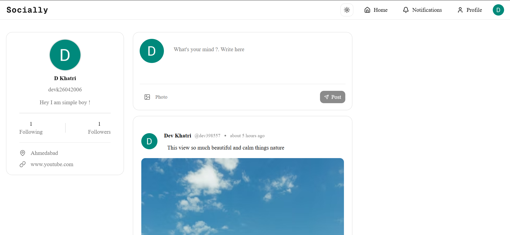
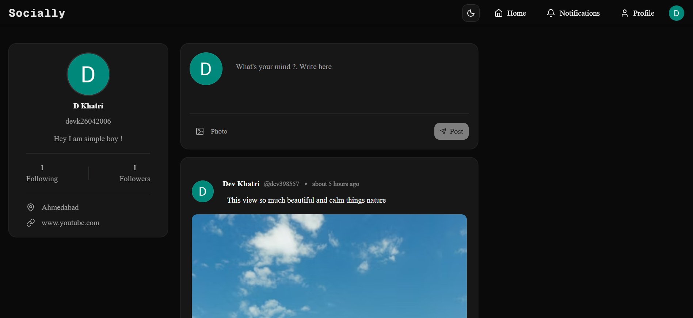
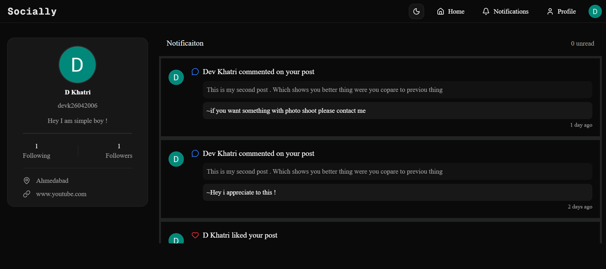
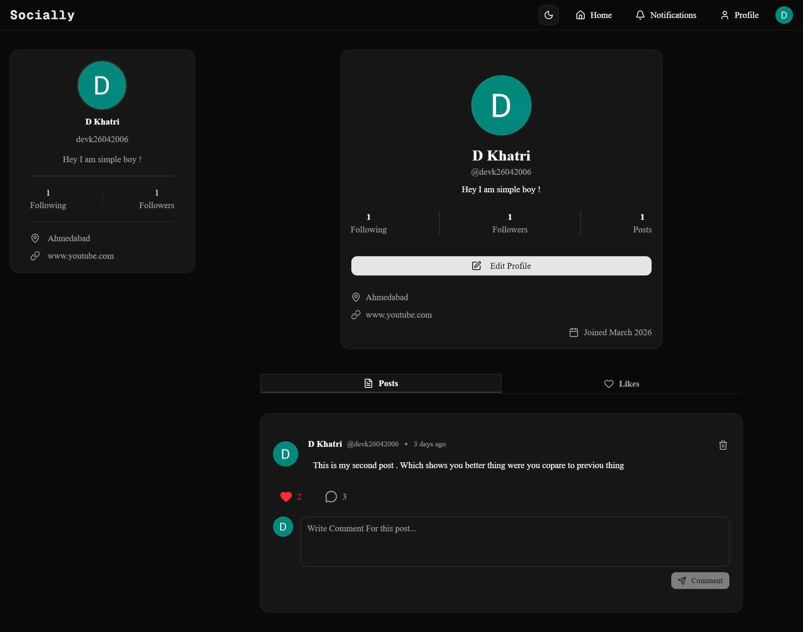
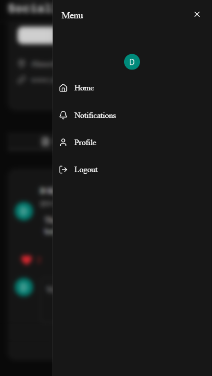

<div align="center">

<br />

<!-- LOGO / BANNER -->


<h1>🌐 Socially</h1>

<p align="center">
  <b>A modern, full-stack social media platform built with Next.js</b><br/>
  Connect · Share · Engage — beautifully.
</p>

<br/>

[](https://socially-roan-nine.vercel.app/)
[](https://nextjs.org/)
[](https://www.typescriptlang.org/)
[](https://vercel.com/)

<br/>

</div>

---

## ✨ Overview

**Socially** is a feature-rich, modern social media application that brings people together. It supports Google OAuth and email/password authentication, real-time-style notifications, profile management, image uploads, and a sleek dark/light theme — all wrapped in a fully responsive UI.

> 🔗 **Live App:** [https://socially-roan-nine.vercel.app/](https://socially-roan-nine.vercel.app/)

---

## 📸 Screenshots

> some screenshots are attached

|                Light Mode                 |
| :---------------------------------------: |
|  |

|                Dark Mode                |
| :-------------------------------------: |
|  |

|                  Notifications                  |
| :---------------------------------------------: |
|  |

|             Profile Page             |
| :----------------------------------: |
|  |

|            Mobile View             |
| :--------------------------------: |
|  |

---

## 🚀 Features

### 🔐 Authentication

- Sign in with **Google OAuth** (via Clerk)
- Sign in with **Email & Password**
- Secure, session-based auth powered by **Clerk**

### 🔔 Notifications

- Real-time-style notification system
- Get notified when someone **likes** your post
- Get notified when someone **comments** on your post
- Get notified when someone **follows** you

### 👤 Profile

- Dedicated profile page showing your posts and details
- **Edit Profile** — update your name, bio, location, and website link
- View followers / following counts

### 🌗 Theme Toggle

- Seamless **Dark / Light mode** switch
- Persisted preference across sessions

### 📱 Responsive Design

- Fully responsive layout for all screen sizes
- **Mobile-friendly navbar** for smooth navigation on small screens

### 🖼️ Image Uploads

- Upload and share images powered by **UploadThing**
- Fast, reliable, and storage-efficient

### 💬 Toast Notifications

- Instant feedback on all user actions via elegant toast messages

---

## 🛠️ Tech Stack

| Category           | Technology                                                        |
| ------------------ | ----------------------------------------------------------------- |
| **Framework**      | [Next.js](https://nextjs.org/) (App Router)                       |
| **Language**       | [TypeScript](https://www.typescriptlang.org/)                     |
| **Authentication** | [Clerk](https://clerk.com/) — Google OAuth + Email/Password       |
| **Database**       | [Neon PostgreSQL](https://neon.tech/) — Serverless Postgres       |
| **ORM**            | [Prisma](https://www.prisma.io/)                                  |
| **UI Components**  | [shadcn/ui](https://ui.shadcn.com/)                               |
| **Styling**        | [Tailwind CSS](https://tailwindcss.com/)                          |
| **Image Uploads**  | [UploadThing](https://uploadthing.com/)                           |
| **Toast Messages** | [React Hot Toast](https://react-hot-toast.com/) / React Hot Toast |
| **Deployment**     | [Vercel](https://vercel.com/)                                     |

---

---

## ⚙️ Getting Started

### Prerequisites

- Node.js `v18+`
- A [Neon](https://neon.tech/) PostgreSQL database
- A [Clerk](https://clerk.com/) account
- An [UploadThing](https://uploadthing.com/) account

### 1. Clone the repository

```bash
git clone https://github.com/Dev26khatri/Socially.git
cd socially
```

### 2. Install dependencies

```bash
npm install
# or
yarn install
```

### 3. Set up environment variables

Create a `.env.local` file in the root directory:

```env
# Database (Neon PostgreSQL)
DATABASE_URL="postgresql://..."

# Clerk Authentication
NEXT_PUBLIC_CLERK_PUBLISHABLE_KEY=public key
CLERK_SECRET_KEY=clerk secret key

DATABASE_URL=from neon

UPLOADTHING_TOKEN=from uploadThing

```

### 4. Set up the database

```bash
npx prisma generate
npx prisma db push
```

### 5. Run the development server

```bash
npm run dev
```

Open [http://localhost:3000](http://localhost:3000) in your browser. 🎉

---

## 🗄️ Database Schema (Overview)

```prisma
model User{
  id                  String @id       @default(cuid())
  email               String @unique
  username            String @unique
  clerkId             String @unique
  name                String?
  bio                 String?
  image               String?
  location            String?
  website             String?
  createdAt           DateTime  @default(now())
  updatedAt           DateTime  @updatedAt

  //Relationship
  posts               Post[] // one-to-many Relationship
  comments            Comment[] // one-to-many Relationship
  likes               Like[] // one-to-many Relationship

  followers           Follows[] @relation("following") // users who follow this user
  following           Follows[] @relation("follower") // users this user follows

  notification        Notification[] @relation("userNotifications") //Notification Received By a User
  notificationCreated Notification[] @relation("notificationCreator") //Notification triggered by a user

}
model Post{
  id            String @id @default(cuid())
  authorId      String
  content       String?
  image         String?
  createdAt     DateTime @default(now())
  updateAt      DateTime @updatedAt

  author User @relation(fields: [authorId] , references: [id] , onDelete: Cascade) //Cascade means delete all post when author is deleted

  comments      Comment[]
  likes         Like[]
  notifications Notification[]
}

model Comment{
  id          String   @id @default(cuid())
  content     String
  authorId    String
  postId      String
  createdAt   DateTime     @default(now())

  //Relationship
  author User @relation(fields: [authorId], references: [id], onDelete: Cascade)
  post   Post @relation(fields: [postId], references: [id],onDelete: Cascade)
  notification Notification[]

  @@index([authorId,postId]) // Composite index for faster queries
}

model Like {
  id         String    @id @default(cuid())
  postId     String
  userId     String
  createdAt  DateTime      @default(now())

  user User @relation(fields: [userId] , references: [id],onDelete: Cascade)
  post Post @relation(fields: [postId],references: [id],onDelete: Cascade )

  @@index([userId,postId])//Composite index for faster queries
  @@unique([userId,postId]) //This prevents same user liking post twice
}

model Follows{
  followerId  String
  followingId String
  createdAt   DateTime @default(now())

  //Relations
  follower   User  @relation("follower" , fields: [followerId],references: [id],onDelete: Cascade)
  following  User  @relation("following",fields: [followingId],references: [id],onDelete: Cascade)

  @@index([followerId,followingId])
  @@id([followerId,followingId])

}
model Notification {
  id        String   @id @default(cuid())
  userId    String
  creatorId String
  type      NotificationType
  read      Boolean  @default(false)
  postId    String?
  commentId String?
  createdAt DateTime @default(now())

  // Relations
  user      User     @relation("userNotifications", fields: [userId], references: [id], onDelete: Cascade)
  creator   User     @relation("notificationCreator", fields: [creatorId], references: [id], onDelete: Cascade)
  post      Post?    @relation(fields: [postId], references: [id], onDelete: Cascade)
  comment   Comment? @relation(fields: [commentId], references: [id], onDelete: Cascade)


  @@index([userId, createdAt])
}

enum NotificationType {
  LIKE
  COMMENT
  FOLLOW
}
```

---

## 🚢 Deployment

This project is deployed on **Vercel**.

To deploy your own instance:

1. Push your code to GitHub
2. Import the repo on [Vercel](https://vercel.com/new)
3. Add all environment variables from `.env.local`
4. Click **Deploy** 🚀

---

## 🤝 Contributing

Contributions, issues, and feature requests are welcome!

1. Fork the project
2. Create your feature branch: `git checkout -b feature/amazing-feature`
3. Commit your changes: `git commit -m 'Add amazing feature'`
4. Push to the branch: `git push origin feature/amazing-feature`
5. Open a Pull Request

---

## 📄 License

This project is licensed under the **MIT License** — see the [LICENSE](./LICENSE) file for details.

---

<div align="center">

Made with ❤️ by **[Dev Khatri](https://github.com/Dev26khatri)**

⭐ **Star this repo** if you found it helpful!

[](https://github.com/Dev26khatri/socially)

</div>
